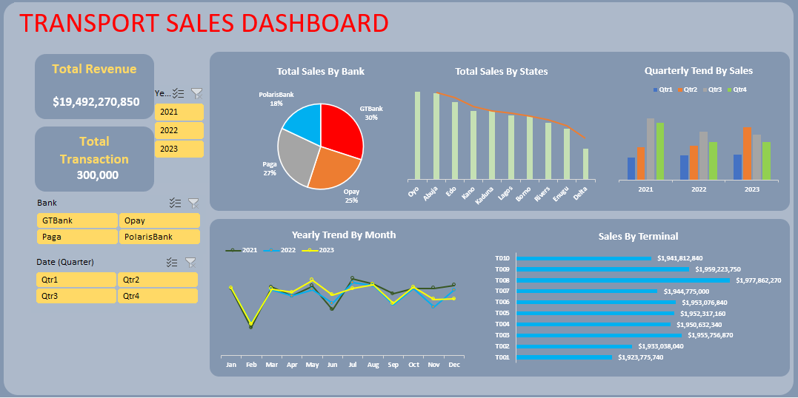
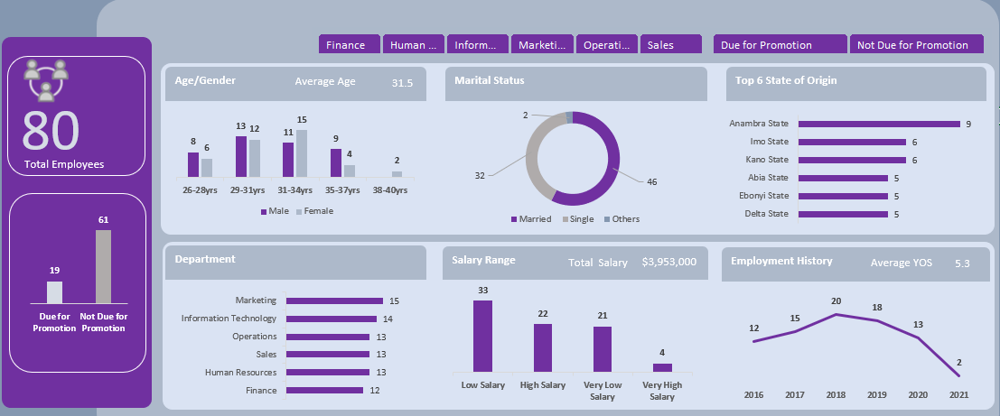
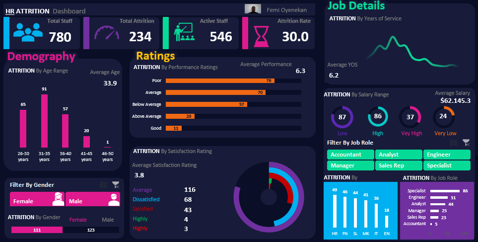

# Project 1
 
**Title: [Retail_Sales Interactive Dashboard](https://github.com/Adeola2904/Adeola2904.github.io/blob/main/Oluwafemi%20Retail%20Sales%20Dashboard.xlsx)
 
**Tools Used:** Microsoft Excel (Pivot Chart, Pivot tables, Conditional formating, filters, slicers)
 
**Project Description:**
 
**Key findings:**
 
**Dashboard Overview:**

# Project 2
 
**Title: [Transport Company Revenue Dashboard](https://github.com/Adeola2904/Adeola2904.github.io/blob/main/Transport%20Company%20DB.xlsx)
 
**Tools Used:** Microsoft Excel (Pivot Chart, Pivot tables, Conditional formating, filters, slicers,)
 
**Project Description:**
 
**Key findings:**
 
**Dashboard Overview:**

# Project 3
 
**Title:** [HR Employee Dashboard](https://github.com/Adeola2904/Adeola2904.github.io/blob/main/HR%20Employee%20Dashboard.xlsx)
 
**Tools Used:** Microsoft Excel (Pivot Chart, Pivot tables, Conditional formating, filters, slicers, Power Query Editor, Data Modelling)
 
**Project Description:** In my analysis of the HR data, I aimed to understand the composition and needs of the company's workforce to inform strategic decisions, particularly regarding promotions. My focus was identifying staff eligible for promotion based on tenure, analyzing salary distributions, understanding demographic trends, and recognizing regional representation. This comprehensive overview provides valuable insights and actionable recommendations to support the company's goal of fostering a motivated, well-compensated, and loyal workforce.
**Key findings:** Long-term Employees: Nearly a quarter of the staff (19 out of 80) have been with the company for 7 years or more. This shows that many employees are committed and have stuck with the company for a long time, highlighting stability and loyalty.
Eastern Majority: Over half of the employees (51%) are from the East. This could mean that the company has strong roots in that region, which is something to keep in mind for future hiring and regional engagement.
Low Salaries for Most: A large majority (68%) of the employees are earning low salaries, while only 33 out of 80 are earning high salaries. This might suggest a need to revisit the pay structure to ensure fairness and motivate employees.
Young Workforce: The largest group of employees is aged between 29 and 34 years. This young and dynamic group is likely ambitious and energetic, ready to take on new challenges.
Family Responsibilities: With 58% of employees being married, many have family responsibilities, which could mean that financial security is a significant concern for them.

Recommendations:
Promotion and Career Development: Since many employees have been with the company for over 7 years, it's important to recognize their loyalty. While promoting based on tenure is a good start, adding performance and skill development into the criteria can motivate everyone to continually improve.
Review Salary Structure: With most employees earning low salaries, conducting a salary review is crucial. Aligning pay with industry standards and ensuring competitive compensation can help in retaining talented staff and keeping them motivated.
Support for Family-Oriented Employees: Considering that many employees have families, introducing financial wellness programs, childcare support, or flexible working hours can make a big difference. These initiatives can help employees manage their work-life balance better, leading to increased job satisfaction and productivity.
Engage Young and Regional Talent:
Develop Young Leaders: Given the youthful nature of the workforce, offering leadership development programs can harness their potential and prepare them for future roles. Additionally, recognizing the strong presence from the East, regional engagement initiatives can foster a deeper connection with the community and enhance company loyalty
**Dashboard Overview:**

# Project 4
 
**Title:** [HR Attrition Dashboard](https://github.com/Adeola2904/Adeola2904.github.io/blob/main/HR%20Attrition%20Dashboard.xlsx)
 
**Tools Used:** Microsoft Excel (Pivot Chart, Pivot tables, Conditional formating, filters, slicers, Data cleansing and Transformation, Descriptive modelling, Analysis and visual, interactive Dashboard design)
 
**Project Description:** Attrition by demography, Gender, age, and Job role
 
**Key findings:**
 
**Dashboard Overview:**

# Project 5
**Title:** Employee ID Dashboard
 
**SQL Code:** [Sql queries](https://github.com/Adeola2904/Adeola2904.github.io/blob/main/Employee_Data.Sql)
 
**SQL Skills Used:**
 
**Project Description:**
 
**Technology used:** SQL server
